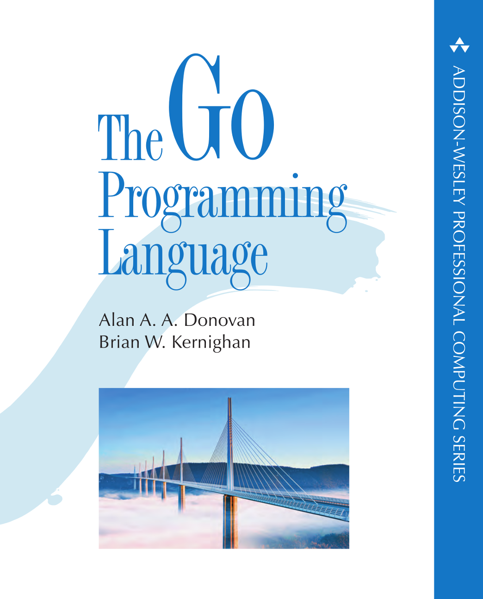

# [Go to Theory](./Theory/Theory.md)
# [Go to Implementations](./Implementations/Implementations.md)

## The Idea Behind Go
#### We found that there is a problem with compiled languages
#### like (C, C++), which is that these languages become more complex
#### and hard to read in very large projects. So, we needed a language
#### that is simpler. A very good option for that was interpreted
#### languages like (Python, JavaScript), but they are too slow and not
#### efficient for very large projects due to performance limitations.
#### This is where `Go` comes in—a language that offers both good performance
#### and simplicity.

##### **The most recent release of go now is `1.23.1`**

## Tha main Book of this Repo       

