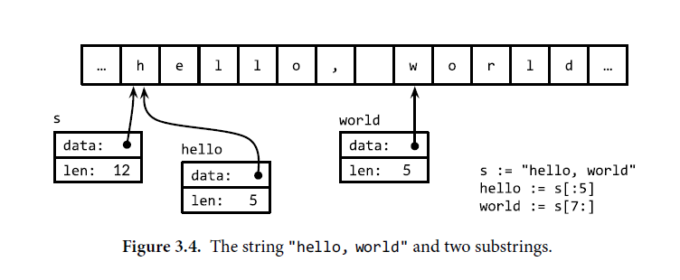

# [Go Back](../README.md)
# [Go to Implementations](./Implementations/Implementations.md)
<hr/>


# CH1

# Go philosophy
#### Go has a strong enough type system to avoid most careless mistakes found in dynamic languages.
#### Its type system is simpler compared to other statically typed languages.
#### Go can lead to some "untyped" pockets within its type-safe framework.
#### Go programmers do not use types for safety proofs like in C++ or Haskell.
#### Despite a simpler type system, Go provides safety and performance benefits without much complexity.
#### Go emphasizes modern system design, focusing on data locality.
#### Its data types and libraries work naturally without needing explicit initialization or constructors.
#### Go avoids hidden memory allocations and writes in code.

<hr/>

## Hello World
```Go
package main

import "fmt"

func main() {
    fmt.Println("Hello, world!")
}

```

#### Go code is organized into packages,
#### which are similar to libraries or modules in other
#### languages. A package consists of one or more .go source files
#### in a single directory that
#### define what the package does. Each source file begins with a
#### package declaration, here `package main`, that states which package the file belongs to,
#### followed by a list of other packages that it imports, and then the declarations
#### of the program that are stored in that file.
<hr/>

# package `main`

#### Package `main` is special. It defines a standalone executable
#### program, not a library. Within `package main`, the
#### function `main` is
#### also special—it’s where execution of the program begins. Whatever `main`
#### does is what the program does. Of course, `main` will normally call upon
#### functions in other packages to do much of the work, such as
#### the function `fmt.Println`.

# import()

#### The import declarations must follow the package declaration. 
#### After that,a program consists of the declarations of functions, variables,
#### constants, and types
#### (introduced by the keywords func, var, const, and type);

<hr/>

# variables
### you can declare a variable with
```Go
s := ""
var s string
var s = ""
var s string = ""
```
### some very usefull format expresions
|sympol                       | mean                                        |
|:---------------------------:|:--------------------------------------------|
| `%d`                        | decimal integer                             |
| `%x` , `%o` , `%b`          | integer in hexadecimal,cotal,binary         |
| `%f` , `%g` , `%e`          | floating number 3.14 , 3.1415926 , 3.14e+00 |
| `%t`                        | boolean                                     |
| `%c`                        | rune (unicode code point)                   |               
| `%s`                        | string                                      |
| `%q`                        | quoted string "abc"                         |
| `%v`                        | any value in a natural format               |
| `%T`                        | Type of any value                           |
| `%p`                        | pointer value (show memory address)
| `%%`                        | literal percent sign (no operand)

### When printing numbers using the fmt package, we can control the radix and for mat with the

### %d, %o, and %x verbs, as shown in this example:

## Types of print functions on golang

```go

fmt.Println(...interface{}) (int , error)
fmt.Printf(string , ...interface{}) (int , error)


fmt.Fprintln(io.Writer , ...interface{}) (int , error)
fmt.Fprintf(io.Writer , string ,...interface{}) (int , error)


fmt.Sprintln(...interface{}) (string)
fmt.Sprintf( string ,...interface{}) (string)


```

### simple tricks not mentioned  on the table 

```go
// show output on 6 digits if there is no digit put white space
 var x , y  = 1234 , 12
 fmt.Printf("|%6d|\n|%6d|", x , y)
 /*
 |  1234|
 |    12|%   
 */

 // add zero instead of the white spaces
 var x , y  = 1234 , 12
 fmt.Printf("|%06d|\n|%06d|", x , y)
 /*
 |001234|
 |000012|%  
 */


// if you want the white spaces to be at the end
 var x , y  = 1234 , 12
 fmt.Printf("|%-6d|\n|%-6d|", x , y)
 /*
|1234  |
|12    |%                                                                              
 */

```
## more tricks
### slices
```go
s := []int{1,2,3}
fmt.Printf("%T\n" , s)
fmt.Printf("%v\n" , s)
fmt.Printf("%#v\n" ,s)
/*
[]int
[1 2 3]
[]int{1, 2, 3}
*/
```
### Arrays
```go
arr := [3]int{1, 2, 3}
fmt.Printf("%T\n", arr)
fmt.Printf("%v\n", arr)
fmt.Printf("%#v\n", arr)
/*
[3]int
[1 2 3]
[3]int{1, 2, 3}
*/
```
### map
```go

fmt.Printf("%T\n", m)
fmt.Printf("%v\n", m)
fmt.Printf("%#v\n", m)
/*
map[string]int
map[one:1 three:3 two:2]
map[string]int{"one":1, "three":3, "two":2}
*/

```

### Functions
```go
f := func(x int) int {
    return x * x
}
fmt.Printf("%T\n", f)
fmt.Printf("%v\n", f)
fmt.Printf("%#v\n", f)
/*
func(int) int
<function>
func(int) int
*/

```

```go
o := 0666    // convert from octal to decimal on first output
fmt.Printf("%d %[1]o %#[1]o\n", o) // "438 666 0666"
x := int64(0xdeadbeef)
fmt.Printf("%d %[1]x %#[1]x %#[1]X\n", x)
// Output:
// 3735928559 deadbeef 0xdeadbeef 0XDEADBEEF
```
### Usually a Printf format string containing multiple % verbs
### would require the same number of extra operands, but the [1] ‘‘adverbs’’ after % tell Printf to
### use the first operand over and over again. Second, the # adverb for %o or %x or %X tells Printf
### to emita 0 or 0x or 0X prefix respectively.

```go 
ascii := 'a'
unicode := 'D'
newline := '\n'
fmt.Printf("%d %[1]c %[1]q\n", ascii) // "97 a 'a'"
fmt.Printf("%d %[1]c %[1]q\n", unicode) // "22269 D 'D'"
fmt.Printf("%d %[1]q\n", newline) // "10 '\n'"
```

#### Go comes with an extensive standard library of useful packages, and the Go
#### community has created and shared many more.

#### Programming is often more about using existing packages than about
#### writing original code of one’s own.

#### Throughout the book, we will point out a couple of dozen of the most important
#### standard package

# CH2
 
# Go has 25 keywords they can’t be used as names.
```go
break
case
chan
const
continue
default
defer
else
fallthrough
for
func
go
goto
if
import
interface
map
package
range
return
select
struct
switch
type
var
```

### In addition, there are about three dozen predeclared
### names like int and true for built-in constants , types, functions

## Constants: 
```Go
true  false  iota  nil
```
## Types:
```Go
  int  int8  int16  int32  int64 uint
  uint8  uint16  uint32  uint64
  uintptr float32  float64  complex128  
 complex64 bool  byte  rune  string  error
```


## Functions:  
```Go
 make  len  cap  new  append  copy
 close  delete complex  real  imag 
 panic  recover
```


## Access declared functions and variables in Go

```Go
package main


import("fmt")

// Boiling prints the boiling point of water.
const boilingF = 212.0
func main11() {
    var f = boilingF
    var c = (f - 32) * 5 / 9
    fmt.Printf("boiling point = %g°F or %g°C\n", f, c)
    // Output:
    // boiling point = 212°F or 100°C
}
```

#### The constant boilingFis a package-level declaration (as is
#### main), whereas the variables fand care
#### local to the function main.

#### The name of each package-level entity is
#### visible not only throughout the source file that contains its
#### declaration, but throughout all the files of the package.


#### By contrast, local declarations are visible only within
#### the function in which they are declared and perhaps only within a
#### small part of it.


## pointers in Go
```Go
var x, y int
fmt.Println(&x == &x, &x == &y, &x == nil) 
// "true false false"
/************/
var p = f()
func f() *int {
    v := 1
    return &v
}

// each call return a different value
fmt.Println(f() == f()) // "false"

/**********************/

func incr(p *int) int {
    *p++ // increments what p points to; does not change p
    return *p
}

/***********************/

p := new(int)
fmt.Printf(*p) // 0
/*
The new built-in function allocates memory. The first argument is 
a type, not a value, and the value returned is a pointer to a 
newly allocated zero value of that type.
*/


```
# Types in Go
```Go
// Package tempconv performs Celsius and Fahrenheit temperature computations.
package tempconv

import "fmt"


type Celsius float64
type Fahrenheit float64

const (
    AbsoluteZeroC Celsius = -273.15
    FreezingC     Celsius = 0
    BoilingC      Celsius = 100
)

func CToF(c Celsius) Fahrenheit { return Fahrenheit(c*9/5 + 32) }

func FToC(f Fahrenheit) Celsius { return Celsius((f - 32) * 5 / 9) }
```


# Ch3


## More on Types 


### Go provides both signed and unsigned integer arithmetic.
### There are four distinct sizes of
### signed integers—8, 16, 32, and 64 bits—represented by the types
### int8, int16, int32, and int64, and corresponding unsigned
### versions uint8, uint16, uint32, and uint64
### the number after the type is the numbers  of bits 

```Go
	// Boolean type
	var isGoFun bool = true // stored on 8 bits
	fmt.Println("Boolean value:", isGoFun)

	// Integer types
	var intVal int = 42                    // Default integer type (depends on platform architecture) mostly 32 or 64
	var int8Val int8 = -128                // 8-bit signed integer (-128 to 127)
       var int16Val int16 = 32767             // 16-bit signed integer (-32,768 to 32,767)
	var int32Val int32 = 2147483647        // 32-bit signed integer (-2,147,483,648 to 2,147,483,647)
	var int64Val int64 = 9223372036854775807 // 64-bit signed integer (-2^63 to 2^63-1)
	fmt.Println("Integers:", intVal, int8Val, int16Val, int32Val, int64Val)

	// Unsigned integer types
	var uintVal uint = 42                    // Default unsigned integer type (depends on platform architecture)
	var uint8Val uint8 = 255                 // 8-bit unsigned integer (0 to 255)
	var uint16Val uint16 = 65535             // 16-bit unsigned integer (0 to 65535)
	var uint32Val uint32 = 4294967295        // 32-bit unsigned integer (0 to 4,294,967,295)
	var uint64Val uint64 = 18446744073709551615 // 64-bit unsigned integer (0 to 2^64-1)
	fmt.Println("Unsigned Integers:", uintVal, uint8Val, uint16Val, uint32Val, uint64Val)
```

## Important Note on types
### As an example familiar from other contexts, consider this sequence:
```go
var apples int32 = 1
var oranges int16 = 2
var compote int = apples + oranges // compile error
```
### At tempting to compile these three declarations produces an error message:
### invalid operation: apples + oranges (mismatched types int32 and int16)
### This typ e mismatch can be fixe d in several ways, most direc tly by converting everything to a
### common type:

```go
 var compote = int(apples) + int(oranges)
```

## Floating numbers

```Go
	// Boolean type
	var isGoFun bool = true
	fmt.Println("Boolean value:", isGoFun)

	// Integer types
	var intVal int = 42                    // Default integer type (depends on platform architecture)
	var int8Val int8 = -128                // 8-bit signed integer (-128 to 127)
	var int16Val int16 = 32767             // 16-bit signed integer (-32,768 to 32,767)
	var int32Val int32 = 2147483647        // 32-bit signed integer (-2,147,483,648 to 2,147,483,647)
	var int64Val int64 = 9223372036854775807 // 64-bit signed integer (-2^63 to 2^63-1)
	fmt.Println("Integers:", intVal, int8Val, int16Val, int32Val, int64Val)

	// Unsigned integer types
	var uintVal uint = 42                    // Default unsigned integer type (depends on platform architecture)
	var uint8Val uint8 = 255                 // 8-bit unsigned integer (0 to 255)
	var uint16Val uint16 = 65535             // 16-bit unsigned integer (0 to 65535)
	var uint32Val uint32 = 4294967295        // 32-bit unsigned integer (0 to 4,294,967,295)
	var uint64Val uint64 = 18446744073709551615 // 64-bit unsigned integer (0 to 2^64-1)
	fmt.Println("Unsigned Integers:", uintVal, uint8Val, uint16Val, uint32Val, uint64Val)

	// Floating-point types
	var float32Val float32 = 3.14  // 32-bit floating-point number
	var float64Val float64 = 3.141592653589793 // 64-bit floating-point number
	fmt.Println("Floats:", float32Val, float64Val)
```

### A float32 provides approximately six decimal digits of precision, where as a float64
### prov ides about 15 digits; float64 should be preferred for most purposes because float32
### computation sacc umulate error rapidly unless one is quite careful

```go
var f float32 = 16777216 // 1 << 24
fmt.Println(f == f+1) // "true"!
```
### how realy the floating numbers work in Go
```go
for x := 0; x < 8; x++ {
fmt.Printf("x = %d eA = %8.3f\n", x, math.Exp(float64(x)))
}
/*
x = 0 eA =    1.000
x = 1 eA =    2.718
x = 2 eA =    7.389
x = 3 eA =   20.086
x = 4 eA =   54.598
x = 5 eA =  148.413
x = 6 eA =  403.429
x = 7 eA = 1096.633
*/
```
### notice that when i say %8.3f i say that you must print the number
### on at least 8 digits width and with three decimal digits of precision
### if the number smaller than 8 digits add space at left of it or add '0' at the end

## Strings 

```Go
       // normal way
       var carType string = "BMW"
       // let go give the type
       carType := "BMW"
       // one line declaration
 
	   // String type
	   var str string = "Hello, Go!"
	   fmt.Println("String:", str)

       // normal way
       var carType string = "BMW"
       // let go give the type
       carType := "BMW"
       // one line declaration
       car,price := "BMW",20_000_000

```
### how go handle the Strings
#### you need to know that strings are just slice of bytes no more so it you try that :
```go

s := "hello, world"
fmt.Println(len(s)) // "12"
fmt.Println(s[0], s[7]) // "104 119" ('h' and 'w')

/**********/

fmt.Println(s[0:5]) // "hello"
fmt.Println(s[:5]) // "hello"
fmt.Println(s[7:]) // "world"
fmt.Println(s[:]) // "hello, world"
s[0] = 'L' // compile error: cannot assign to s[0]
// strings in go are immutable

```
#### Immutability means that it is safe for two copies of a string to share the same underlying
#### memory, making it cheap to copy strings of anylength. Similarly, a strings and a substring
#### like s[7:] may safely share the same data, so the substring operation is also cheap. No new
#### memory is allocated in either case. Figure 3.4 illustrates the arrangement of astring and two
#### of its subst rings sharing the same underlying byte array.



#### there is one more inmportant thing on Strings
#### if you use  `` ` ``  instead of `` ' `` the /n /t ...etc has no effect
```go
fmt.Println(`hello, \n\tworld`)
// hello, \n\tworld
```
## convert str -> int || str <- int

```go
x := 123
y := fmt.Sprintf("%d", x)
fmt.Println(y, strconv.Itoa(x)) // "123 123"
fmt.Println(strconv.FormatInt(int64(x), 2)) // "1111011"
s := fmt.Sprintf("x=%b", x) // "x=1111011"
x, err := strconv.Atoi("123") // x is an int
y, err := strconv.ParseInt("123", 10, 64) // base 10, up to 64 bits

```


## Complex,rune,byte

```Go
	// Complex number types
	var complex64Val complex64 = 1 + 2i    // 64-bit complex number
	var complex128Val complex128 = 3.14 + 2.71i // 128-bit complex number
	fmt.Println("Complex numbers:", complex64Val, complex128Val)

	// Rune type (alias for int32, represents a Unicode code point)
	var runeVal rune = 'G'
	fmt.Println("Rune (character):", runeVal)

	// Byte type (alias for uint8, represents a single byte)
	var byteVal byte = 255
	fmt.Println("Byte:", byteVal)
```

# complex numbers

```Go
var x complex128 = complex(1, 2) // 1+2i
var y complex128 = complex(3, 4) // 3+4i
fmt.Println(x*y)                 // "(-5+10i)"
fmt.Println(real(x*y))           // "-5"
fmt.Println(imag(x*y))           // "10"

```

## Go Escape Sequences Table


| Escape Sequence | Character Represented       |
|-----------------|-----------------------------|
| `\\`            | Backslash (`\`)             |
| `\'`            | Single Quote (`'`)          |
| `\"`            | Double Quote (`"`)          |
| `\n`            | Newline (`\n`)              |
| `\r`            | Carriage Return (`\r`)      |
| `\t`            | Tab (`\t`)                  |
| `\v`            | Vertical Tab (`\v`)         |
| `\f`            | Form Feed (`\f`)            |
| `\xNN`          | Hexadecimal (`\xNN`)        |
| `\uNNNN`        | Unicode (`\uNNNN`)          |
| `\U00NNNNNN`    | Unicode (`\U00NNNNNN`)      |

**Note:**  
- `\xNN` represents a character with hexadecimal code `NN`.  
- `\uNNNN` represents a Unicode character with hexadecimal code `NNNN`.  
- `\U00NNNNNN` represents a Unicode character with a longer hexadecimal code `00NNNNNN`.

## constants on go 

```Go

const ( 
	a = 1
	b 
	c 
	d 
	e 
	f =2 
	g 
)
fmt.Println(a,b,c,d,e,f) // 1 1 1 1 1 2 2 

```

## Go Bitwise
``` go
& //bit wise AND
| //bit wise OR
^ //bit wise XOR
&^ //bit clear (AND NOT)
<< //left shift
>> //right shift
```

# Ch4
### Composite Types
### Arrays
```go
var q [3]int = [3]int{1, 2, 3}
var r [3]int = [3]int{1, 2}
fmt.Println(r[2]) // "0"

```

### In an array literal, if an ellipsis ‘‘...’’ appears in place of the lengt h, the array lengt h is determined
### by the number of initializers. The definition of q can be simplified to

```go
q := [...]int{1, 2, 3}
fmt.Printf("%T\n", q) // "[3]int"
```
```go
q := [3]int{1, 2, 3}
q = [4]int{1, 2, 3, 4} // compile error: cannot assign [4]int to [3]int
```
### you can define the array as also key value 
```go
symbol := [...]string{USD: "$", EUR: "9", GBP: "!", RMB: ")"}
fmt.Println(RMB, symbol[RMB]) // "3 ")"
r := [...]int{99: -1}
// defines an array r with 100 elements, all zero 
// except for the last, which has value −1.
```
## Slice 
### as the name said the slice is just a pointer , capacity , length
### point to an array to take a part from it as (len()) 

### declare like that 

```go

	
	arr := [5]int{1, 2, 3, 4, 5}
	slice := arr[1:4] // slice contains elements from index 1 to 3
	fmt.Println("Slice from array:", slice)
	// Output: Slice from array: [2 3 4]

	slice2 := make([]int, 3, 5) // length 3, capacity 5
	fmt.Printf("Slice created with make: len=%d cap=%d %v\n", len(slice2), cap(slice2), slice2)
	// Output: Slice created with make: len=3 cap=5 [0 0 0]

	// Appending to a slice
	slice2 = append(slice2, 10)
	fmt.Println("After appending an element:", slice2)
	// Output: After appending an element: [0 0 0 10]

	// Appending multiple elements
	slice2 = append(slice2, 20, 30)
	fmt.Println("After appending multiple elements:", slice2)
	// Output: After appending multiple elements: [0 0 0 10 20 30]

	// Slicing a slice
	slice3 := slice2[1:4]
	fmt.Println("Sliced part of the slice:", slice3)
	// Output: Sliced part of the slice: [0 0 10]

	// Copying slices
	dest := make([]int, len(slice3))
	copy(dest, slice3)
	fmt.Println("Copied slice:", dest)
	// Output: Copied slice: [0 0 10]

	// Iterating over a slice
	fmt.Println("Iterating over slice:")
	for i, v := range slice3 {
		fmt.Printf("Index: %d, Value: %d\n", i, v)
	}
	// Output:
	// Iterating over slice:
	// Index: 0, Value: 0
	// Index: 1, Value: 0
	// Index: 2, Value: 10

	// Modifying elements in a slice
	slice3[0] = 100
	fmt.Println("After modifying an element:", slice3)
	// Output: After modifying an element: [100 0 10]

	// Capacity and length of a slice
	fmt.Printf("Slice length: %d, capacity: %d\n", len(slice3), cap(slice3))
	// Output: Slice length: 3, capacity: 5

	// Reslicing
	slice4 := slice2[:2]  // Take elements from start to index 2 (exclusive)
	slice5 := slice2[2:]  // Take elements from index 2 to the end
	fmt.Println("Resliced slice 1:", slice4)
	// Output: Resliced slice 1: [0 0]
	fmt.Println("Resliced slice 2:", slice5)
	// Output: Resliced slice 2: [10 20 30]

	// Slices of slices (2D slices)
	matrix := make([][]int, 2)  // A slice of 2 slices
	matrix[0] = []int{1, 2, 3}
	matrix[1] = []int{4, 5, 6}
	fmt.Println("2D slice (matrix):", matrix)
	// Output: 2D slice (matrix): [[1 2 3] [4 5 6]]

	// Nil slices
	var nilSlice []int
	if nilSlice == nil {
		fmt.Println("This is a nil slice.")
	}
	// Output: This is a nil slice.

	// Capacity growth
	initialSlice := make([]int, 0, 3)
	fmt.Printf("Initial capacity: %d\n", cap(initialSlice))
	// Output: Initial capacity: 3
	for i := 0; i < 5; i++ {
		initialSlice = append(initialSlice, i)
		fmt.Printf("After append %d: len=%d, cap=%d\n", i, len(initialSlice), cap(initialSlice))
	}
	// Output:
	// After append 0: len=1, cap=3
	// After append 1: len=2, cap=3
	// After append 2: len=3, cap=3
	// After append 3: len=4, cap=6
	// After append 4: len=5, cap=6
	

```

### so as we said slice is just a pointer to an array 
### the capacity is the size of the array that the slice point to
### the length is the size of the slice it self and must be less or equal the capacity
### you can imagine the slice as struct have pointer and len and cap on it
```go
type slice struct{
	ptr *int
	cap int 
	len int
}

```
### the ptr point to the head or first element on that slice maybe first element on the array
### , last element or in the middle 

# the difference between array and slice in go

|slice                                   | array                                   |
|----------------------------------------| ----------------------------------------|
| variable length                        | fixed length at compile timw            |
| passed by reference                    | passed by value (copie them)            |
| Not Comparable                         |  Comparable by `==`                     |
| cannot be used as map key              | can be used as map key                  |
| has copy & append helpers              | no functions made specific for it       |
| Useful as function parameters          |  useful as pesudo constants             |

## map on go

#### In Go, a map is a reference to a hash table, and a map typ e is writt en map[K]V, where K and V
### are the types of its keys and values. All of the keys in a given map are of the same type, and all
### of the values are of the same type 


```go

   // Creating a map to store names and ages
    ages := make(map[string]int)

    // Adding elements to the map
    ages["Alice"] = 25
    ages["Bob"] = 30
    ages["Charlie"] = 22

    // Updating an element
    ages["Alice"] = 26

    // Retrieving elements
    fmt.Println("Alice's age:", ages["Alice"])
    fmt.Println("Bob's age:", ages["Bob"])

    // Checking if a key exists
    if age, exists := ages["Charlie"]; exists {
        fmt.Println("Charlie's age:", age)
    } else {
        fmt.Println("Charlie not found")
    }

    // Iterating over the map
    fmt.Println("All ages:")
    for name, age := range ages {
        fmt.Printf("%s is %d years old\n", name, age)
    }

    // Deleting an element
    delete(ages, "Bob")
    fmt.Println("After deleting Bob:", ages)


```

### struct in Go

### If all the fields of a struct are comparable, the struct itself is comparable, so two expressions of
### that type may be compared using == or !=. The == op eration compares the corresponding
### fields of the two structs in order

### more on the implementation readme file

# Ch5
### Functions
#### go model for a function

```go
func name(parameter-list) (result-list) {
body
}
```

#### The parameter list specifies the names and types of the function’s parameters, which are the
#### local variables whose values or ar guments are sup plied by the caller. The result list specifies
#### the types of the values that the function returns. If the function returns one unnamed result
#### or no results at all, parentheses are optional and usually omitted. Leaving off the result list
#### entirely declares a function that does not return any value and is called only for its effects. In
#### the hypot function

### Here are four ways to declare a function with two parameters and one result, all of type int.
### The blank identifier can be used to emp hasize that a parameter is unused.
 ```go
 func add(x int, y int) int { return x + y }
 func sub(x, y int) (z int) { z = x - y; return }
 func first(x int, _ int) int { return x }
 func zero(int, int) int { return 0 }
 fmt.Printf("%T\n", add) // "func(int, int) int"
 fmt.Printf("%T\n", sub) // "func(int, int) int"
 fmt.Printf("%T\n", first) // "func(int, int) int"
 fmt.Printf("%T\n" , zero) // "func(int, int) int" 
```
### Func tions are first-class values in Go: like other values, function values have typ es, and the y
### may be assig ned to var iables or passed to or retur ned fro m func tions. A func tion value may
### be cal le d li ke any other function. For example:

```go

func square(n int) int { return n * n }
func negative(n int) int { return -n }
func product(m, n int) int { return m * n }
f := square
fmt.Println(f(3)) // "9"
f = negative
fmt.Println(f(3)) // "-3"
fmt.Printf("%T\n", f) // "func(int) int"
f = product // compile error: can't assign f(int, int) int to f(int) int

//The zero value of a function typ e is nil.
//Cal ling a nil function value causes a panic:
var f func(int) int
f(3) // panic: call of nil function
//Func tion values may be compare d with nil:
var f func(int) int
if f != nil {
f(3)
}
// but they are not comparable, so they may not be compared against each other orused as keys
// in a map.
```
## Anonymous Functions
### A function literal is written like a function
### declaration, but without a name following the func keyword

```go
var x = "hello"
var y string = strings.Map(func(r rune) rune {return r+1}, x)

fmt.Println(x) // hello
fmt.Println(y) // ifmmp

```

```go

func squares() func() int {
	var x int
	return func() int {
		x++
		return x * x
	}
}
func main() {
	f := squares()
	fmt.Println(f()) // "1"
	fmt.Println(f()) // "4"
	fmt.Println(f()) // "9"
	fmt.Println(f()) // "16"
}
```
## Variadic Functions 

### A variadic fun cti on is one that can be cal le d with var ying numbers of arguments.

```go

func sum(vals ...int) int {
	total := 0
	for _, val := range vals {
		total += val
	}
	return total
}

func main(){
	var sm = sum(1,2,3,4,5)
	fmt.Println(sm) // 15 
}

```
### how it works under the hood 
### Implicitly, the caller allocates an array, copies the arguments into it, and passes a slice of the
### entire array to the function
## like that 👇
```go
values := []int{1, 2, 3, 4}
fmt.Println(sum(values...)) // "10"

```
### Although the ...int parameter behaves like a slice within the function body, the type of a
### variadic function is distinct from the type of a function with an ordinary slice parameter.

```go

func f(...int) {}
func g([]int) {}
fmt.Printf("%T\n", f) // "func(...int)"
fmt.Printf("%T\n", g) // "func([]int)"

```
## Some Tricks

### There’s no such thing as "pass by reference" in Go.

- When you pass a slice, you're actually passing a descriptor of the underlying array.
- If you modify the slice, you're modifying the array it describes, but you're passing the descriptor (the slice), not the array’s actual memory address.
- same to maps ...etc

### Watch this video to understand more:
[Watch Here](https://youtu.be/wj0hUjRHkPs?list=PLoILbKo9rG3skRCj37Kn5Zj803hhiuRK6)

## more tricks on functions
### tell me what is the output of this programm
```go
func do(m1 map[string]int){
	m1["three"] = 0
	m1 = make(map[string] int)
	m1["four"] = 4
	fmt.Println("the m1 :" , m1)
}

func main(){
	m := map[string]int{"one":1,"seven":7,"three":3}
	do(m)
	fmt.Println("m" , m)
}

```
### the output
```go
/*
the m1 : map[four:4]
m map[one:1 seven:7 three:0]
*/
```
### this was actually the easy part now the real challenge

### what is the output of this program

```go

func do(m1 *map[rune]int){
	(*m1)['c'] = 0
	*m1 = make(map[rune]int)
	(*m1)['d'] = 4
	fmt.Println("the m1 :" , m1)
}

func main(){
	m:= map[rune]int{'d':1 , 'g':2 , 'h':3}
	fmt.Println("the m : " , m )
	do(&m)
	fmt.Println("the m after do() : " , m)
}

```
### the output

```go
/*
the m :  map[100:1 103:2 104:3]
the m1 : &map[100:4]
the m after do() :  map[100:4]
*/
```
## defer keyword 
### defer all it does is instead of excute the statement come after it right away 
### it will wait until the function ends and excute it

```go

func main(){
	a:=10
	defer fmt.Println(a)
	a=11
	fmt.Println(a)
}


// output 11 , 10 
// the last thing that excute is the defer
```

### if you have more than one defer on the function it will store all of them on stack
### one by one and excute what is the top on the stack until the end of $

```go
  var  x = 10
  defer fmt.Println("deferred", x)
  x += 1
  fmt.Println("not deferred", x)
  defer fmt.Println("deferred again", x)
  x += 1
  fmt.Println("not deferred again", x)
/*output
not deferred 11
not deferred again 12
deferred again 11
deferred 10
*/

```
### defer only work on function calls so if you want to implement it on variable 
### you can do that 

```go

func doIt() (a int){
	defer func ()  {
		a = 2
	}()
	a = 1
	return 
}
// will return 2 


```
## example to new panic and  new recover with defer
### panic it like throw error and recover() take that error message 
```go
func main(){
	fmt.Println("first line of main")
	defer func(){ 
		if r:=recover(); r!=nil{
			fmt.Println("Recovered from ", r)
			fmt.Println("here on recover  do some clean up or continue the program on other functions") 
		}
	}()
	var input int
	fmt.Scanln(&input)
	switch input{
	case 1:
		panic("panic1")
	case 2:
		panic("panic2")
	case 3:
		panic("panic3")
	default:
		fmt.Println("default")
	}
	 fmt.Println("This won't be printed if there is panic happen")
}
```

### we know that defer run after the main() function ends or after panic()
### on that defer function if there is panic happen we can handel it

## Closures
```go

func fibo() func() int {
	a, b := 0, 1
  return func() int {
    a, b = b, a+b
    return b
  }
}

func main(){

  var a = fibo()
  fmt.Println(a())
  fmt.Println(a())
  fmt.Println(a())
  fmt.Println(a())
}
// output
// 1 2 3 5 8
```
### variables `a` and `b` on fibo will keep exist until the main function end
### we store a and b on the heap for long life time  
```go
func do(d func()){
	d()
}

func main(){
	for i:=0 ; i<4 ; i++ {
		v:= func(){
			fmt.Printf("%d @ %p \n" , i , &i)
		}
		do(v)
	}
}
// output 
// 0 @ 0xc0000141a8
// 1 @ 0xc0000141a8
// 2 @ 0xc0000141a8
// 3 @ 0xc0000141a8

```

### so why all of `i`'s come with the same memory address ?
> because they are all the same i but update the value on each iteration 
### look at this version of the same code 
```go
func main(){
	s:=make([]func() , 4)
	for i := 0 ; i<4 ; i++{
		s[i] = func(){
			fmt.PrintF("%d @ %p \n" , i , &i)
		}
	}
	
	for i:= 0 ; i <4 ; i++ {
		s[i]()
	}
}
// output
// 4 @ 0xc00009e0f8
// 4 @ 0xc00009e0f8
// 4 @ 0xc00009e0f8
// 4 @ 0xc00009e0f8

```
### if i do simple change  `i:=i` 
```go

func main(){
	s:=make([]func() , 4)
	for i := 0 ; i<4 ; i++{
		i:=i
		s[i] = func(){
			fmt.PrintF("%d @ %p \n" , i , &i)
		}
	}
	
	for i:= 0 ; i <4 ; i++ {
		s[i]()
	}
}
// output
// 0 @ 0xc0000141a8
// 1 @ 0xc0000141b0
// 2 @ 0xc0000141b8
// 3 @ 0xc0000141c0
```
### now we are take new copy and address new memory on each iteration
### now each clusure has it's own value of i and place on memory for i

## new Test 🆕
```go
type user struct{name string ; count int}

func addTo(u *user) {u.count++}

func main(){

	users := []user{{"alice" , 0} , {"bob" , 0}}

	alice := &users[0]
	amy := user{"amy" , 1}

	users = append(users, amy)

	addTo(alice)
      Println(users)

}

```
### the output is `[{alice 0} {bob 0} {amy 1}]` so the question is 
### why alice count 0 and not 1 
### the answer is becuase we alocate the pointer of alice before append
### and the append may change the address of the entire slice 
### so because that we actually increase the old memory and print the new memory for alice 


# Ch6
## Methods

### there is no universally accepted definition of object-oriented programming, for our
### purposes, an object is simply a value or variable that has methods, and a method is a function
### associated with a particular type. An object-oriented program is one that uses methods to
### express the properties and operations of each data structure so that clients need not access the
### object’s representation directly.


